# 🚀 Canary Deployment with Argo Rollouts on DigitalOcean

A complete, production-ready implementation of **Canary Deployment** using Argo Rollouts, Argo CD, Prometheus, and Grafana on DigitalOcean Kubernetes. This project demonstrates advanced progressive delivery strategies with automated rollback capabilities based on metrics analysis.

## 📋 Table of Contents

- [Overview](#overview)
- [Architecture](#architecture)
- [Features](#features)
- [Prerequisites](#prerequisites)
- [Installation Guide](#installation-guide)
  - [1. Environment Setup](#1-environment-setup)
  - [2. Kubernetes Cluster Creation](#2-kubernetes-cluster-creation)
  - [3. Application Development](#3-application-development)
  - [4. Docker Image Building](#4-docker-image-building)
  - [5. Argo Rollouts Installation](#5-argo-rollouts-installation)
  - [6. Argo CD Setup](#6-argo-cd-setup)
  - [7. GitOps Configuration](#7-gitops-configuration)
  - [8. Monitoring Stack](#8-monitoring-stack)
  - [9. Metrics & Analysis](#9-metrics--analysis)
  - [10. Automated Rollback Testing](#10-automated-rollback-testing)
- [Usage](#usage)
- [Project Structure](#project-structure)

## 🎯 Overview

This project implements a **canary deployment strategy** that gradually shifts traffic from a stable version to a new version while continuously monitoring application health. If the new version shows degraded performance or increased error rates, the system automatically rolls back to the previous stable version.

### What is Canary Deployment?

Canary deployment is a progressive delivery technique that reduces the risk of introducing new software versions by slowly rolling out changes to a small subset of users before making it available to everyone.

### Key Benefits

- ✅ **Zero-downtime deployments**
- ✅ **Automated rollback on failures**
- ✅ **Metrics-based deployment decisions**
- ✅ **GitOps workflow integration**
- ✅ **Real-time monitoring and visualization**

---

## 🏗️ Architecture

```
┌─────────────────────────────────────────────────────────────┐
│                      DigitalOcean Cloud                      │
│  ┌────────────────────────────────────────────────────────┐ │
│  │              Kubernetes Cluster (3 Nodes)              │ │
│  │                                                        │ │
│  │  ┌──────────────┐  ┌──────────────┐  ┌─────────────┐ │ │
│  │  │  Argo CD     │  │ Argo Rollouts│  │ Application │ │ │
│  │  │  (GitOps)    │  │  (Canary)    │  │   Pods      │ │ │
│  │  └──────────────┘  └──────────────┘  └─────────────┘ │ │
│  │                                                        │ │
│  │  ┌──────────────┐  ┌──────────────┐  ┌─────────────┐ │ │
│  │  │  Prometheus  │  │   Grafana    │  │ LoadBalancer│ │ │
│  │  │  (Metrics)   │  │(Visualization)│  │   Service   │ │ │
│  │  └──────────────┘  └──────────────┘  └─────────────┘ │ │
│  └────────────────────────────────────────────────────────┘ │
└─────────────────────────────────────────────────────────────┘
         │                    │                    │
         ▼                    ▼                    ▼
    GitHub Repo          Metrics Analysis    External Traffic
```

---

## ✨ Features

### Progressive Delivery
- **Multi-stage rollout**: 20% → 40% → 60% → 80% → 100%
- **Configurable pause durations** between stages
- **Weight-based traffic splitting**

### Automated Analysis
- **Prometheus-based metrics collection**
- **Real-time error rate monitoring**
- **Success/failure thresholds configuration**
- **Automatic rollback on metric violations**

### GitOps Workflow
- **Declarative configuration** in Git
- **Automated synchronization** with Argo CD
- **Self-healing capabilities**
- **Audit trail** of all changes

### Observability
- **Grafana dashboards** for visualization
- **Prometheus metrics** collection
- **Real-time rollout status**
- **Historical deployment tracking**


## 📦 Prerequisites

Before starting, ensure you have:

- **DigitalOcean Account** 
- **Docker Hub Account** 
- **GitHub Account** 
- **Local Machine** with:
  - kubectl
  - helm
  - docker
  - git
  - doctl


---

## 🚀 Installation Guide

## 1. Environment Setup

### Step 1.1: Install Required Tools

#### Install tools
```bash
choco install kubernetes-cli
choco install kubernetes-helm
choco install git
choco install docker-desktop

```

```bash
# Update package list
sudo apt-get update
sudo apt-get install -y apt-transport-https ca-certificates curl

# Install kubectl
curl -fsSL https://packages.cloud.google.com/apt/doc/apt-key.gpg | sudo gpg --dearmor -o /etc/apt/keyrings/kubernetes-archive-keyring.gpg
echo "deb [signed-by=/etc/apt/keyrings/kubernetes-archive-keyring.gpg] https://apt.kubernetes.io/ kubernetes-xenial main" | sudo tee /etc/apt/sources.list.d/kubernetes.list
sudo apt-get update
sudo apt-get install -y kubectl

# Install Helm
curl https://raw.githubusercontent.com/helm/helm/main/scripts/get-helm-3 | bash

# Install Git
sudo apt-get install git

# Install Docker
curl -fsSL https://get.docker.com -o get-docker.sh
sudo sh get-docker.sh
sudo usermod -aG docker $USER
```

### Step 1.2: Verify Installations

```bash
kubectl version --client
helm version
docker --version
git --version
```

---

## 2. Kubernetes Cluster Creation

### Step 2.1: Navigate to Kubernetes Section

1. Log into [DigitalOcean Cloud Console](https://cloud.digitalocean.com)
2. Click the green **"Create"** button at the top
3. Select **"Kubernetes"**


### Step 2.2: Configure Cluster

#### Kubernetes Version
- Select the latest stable version 


#### Datacenter Region
- Choose the region closest to you (e.g., New York, San Francisco, London)


#### Node Pool Configuration
- Click **"Add Node Pool"**
- Select **"Basic nodes"**
- Choose: **2 GB / 1 vCPU** ($12/month per node)
- Set **Node count: 3**


#### Cluster Naming
- Name: `canary-demo-cluster`
- Click **"Create Cluster"**

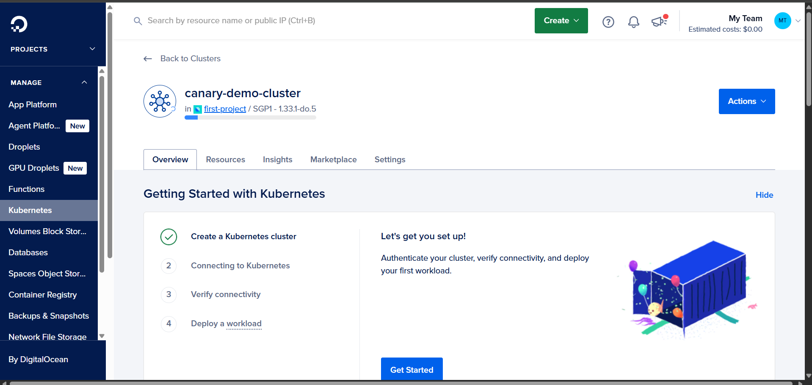

### Step 2.3: Wait for Cluster Provisioning

The cluster takes 3-5 minutes to provision. You'll see a progress indicator.

### Step 2.4: Download Cluster Configuration

Once ready, download the kubeconfig file:

1. Click **"Download Config File"**
2. Save as `k8s-config.yaml`

### Step 2.5: Connect Local Machine to Cluster

```bash
# Create .kube directory
mkdir -p ~/.kube

# Windows (PowerShell):
copy Downloads\k8s-config.yaml $HOME\.kube\config

# Test connection
kubectl get nodes
```

**Expected Output:**

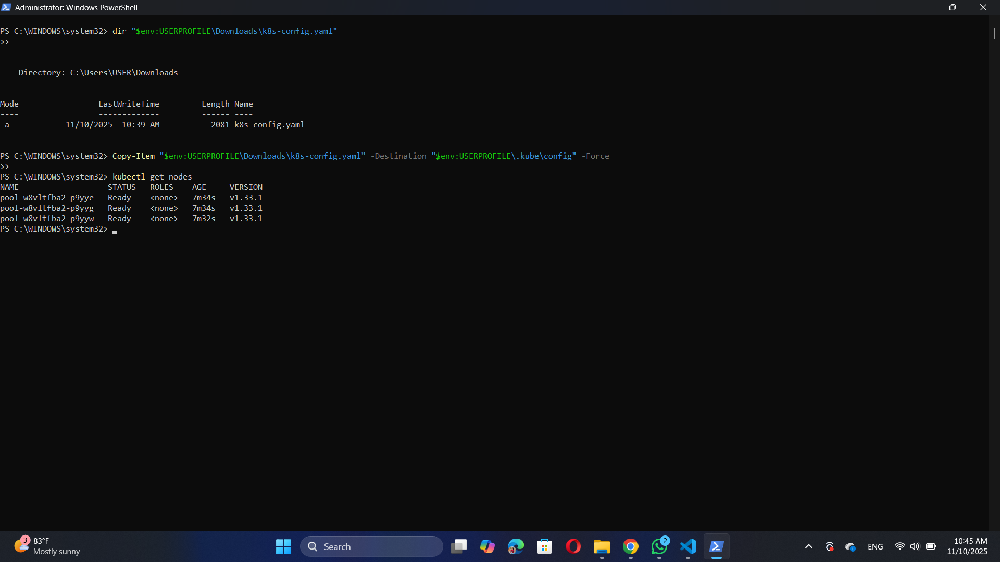

## 3. Application Development

### Step 3.1: Create Project Directory

```bash
mkdir canary-demo
cd canary-demo
```

### Step 3.2: Create Flask Application

Create `app.py`

### Step 3.3: Create Dockerfile

Create `Dockerfile`

### Step 3.4: Create Requirements File

Create `requirements.txt`

---

## 4. Docker Image Building

### Step 4.1: Create Docker Hub Repository

1. Go to [Docker Hub](https://hub.docker.com)
2. Sign in or create account
3. Click **"Create Repository"**
   - Name: `canary-demo-app`
   - Visibility: **Public**
   - Click **"Create"**

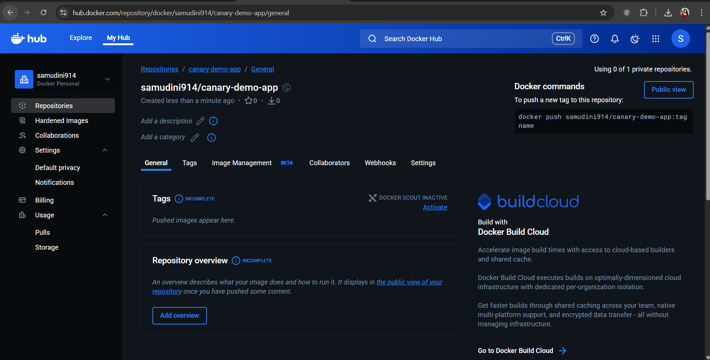

### Step 4.2: Build and Push Images

```bash
# Login to Docker Hub
docker login
# Enter your Docker Hub username and password

# Build version 1
docker build -t yourusername/canary-demo-app:v1 .
docker push yourusername/canary-demo-app:v1

# Build version 2
docker build -t yourusername/canary-demo-app:v2 --build-arg VERSION=v2 .
docker push yourusername/canary-demo-app:v2
```
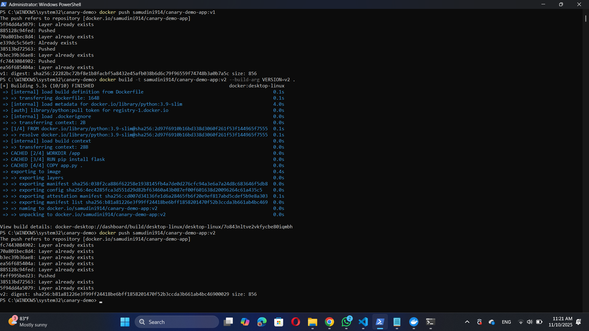


## 5. Argo Rollouts Installation

### Step 5.1: Create Namespace

```bash
kubectl create namespace argo-rollouts
```

### Step 5.2: Install Argo Rollouts

```bash
# Install using kubectl
kubectl apply -n argo-rollouts -f https://github.com/argoproj/argo-rollouts/releases/latest/download/install.yaml

# Wait for pods to be ready
kubectl wait --for=condition=ready pod -l app.kubernetes.io/name=argo-rollouts -n argo-rollouts --timeout=300s

# Verify installation
kubectl get pods -n argo-rollouts
```

**Expected Output:**
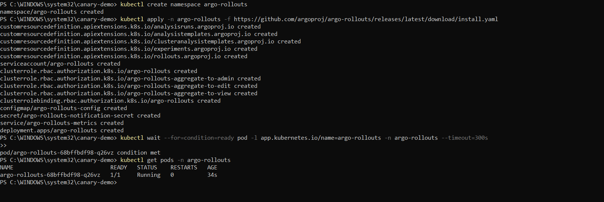


### Step 5.3: Verify Plugin

```bash
kubectl argo rollouts version
```
---

## 6. Argo CD Setup

### Step 6.1: Install Argo CD

```bash
# Create namespace
kubectl create namespace argocd

# Install Argo CD
kubectl apply -n argocd -f https://raw.githubusercontent.com/argoproj/argo-cd/stable/manifests/install.yaml

# Wait for pods to be ready
kubectl wait --for=condition=ready pod -l app.kubernetes.io/name=argocd-server -n argocd --timeout=300s
```
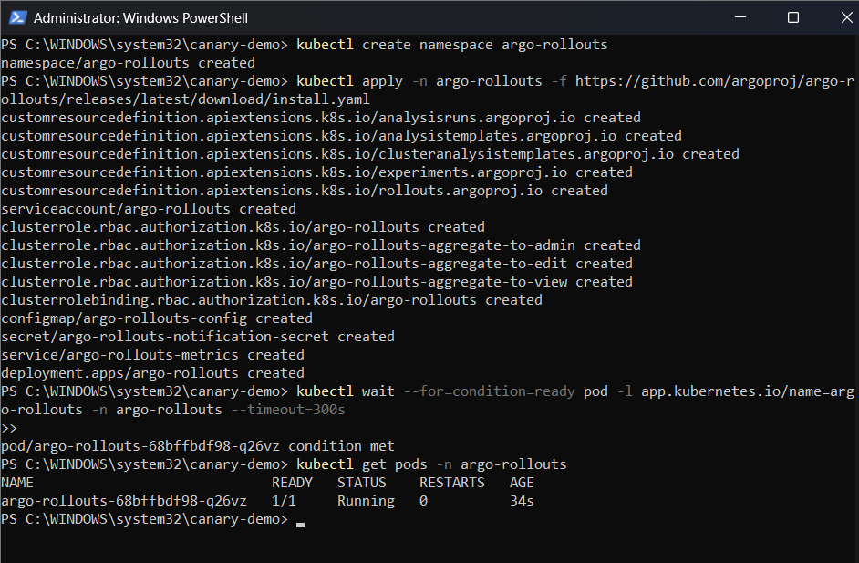


### Step 6.2: Get Admin Password

```bash
kubectl -n argocd get secret argocd-initial-admin-secret -o jsonpath="{.data.password}" | base64 -d
```

### Step 6.3: Access Argo CD UI

```bash
# Port forward (keep this running)
kubectl port-forward svc/argocd-server -n argocd 8080:443
```

Open browser: `https://localhost:8080`

- Username: `admin`
- Password: (from previous step)
- Accept security warning (self-signed certificate)

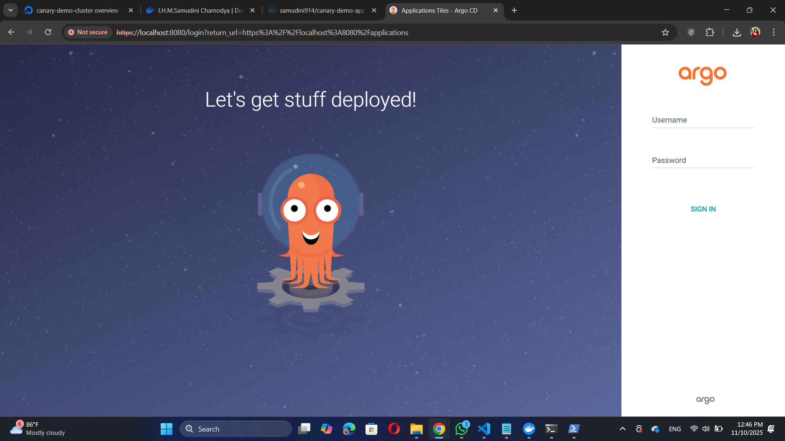


## 7. GitOps Configuration

### Step 7.1: Create GitHub Repository

1. Go to [GitHub](https://github.com)
2. Click **"+"** → **"New repository"**
3. Repository name: `canary-demo-manifests`
4. Visibility: **Public**
5. Click **"Create repository"**


### Step 7.2: Clone Repository

```bash
git clone https://github.com/yourusername/canary-demo-manifests.git
cd canary-demo-manifests
mkdir -p app
```

### Step 7.3: Create Kubernetes Manifests

Create `app/rollout.yaml`

Create `app/service.yaml`

### Step 7.4: Push to GitHub

```bash
git add .
git commit -m "Add canary deployment manifests"
git push origin main
```

## 8. Monitoring Stack

### Step 8.1: Add Prometheus Helm Repository

```bash
helm repo add prometheus-community https://prometheus-community.github.io/helm-charts
helm repo update
```

### Step 8.2: Create Monitoring Namespace

```bash
kubectl create namespace monitoring
```

### Step 8.3: Install Prometheus Stack

```bash
helm install prometheus prometheus-community/kube-prometheus-stack \
  --namespace monitoring \
  --set prometheus.prometheusSpec.serviceMonitorSelectorNilUsesHelmValues=false
```

This installs:
- Prometheus (metrics collection)
- Grafana (visualization)
- Alertmanager (alerting)
- Node Exporter (node metrics)
- Kube State Metrics (K8s metrics)

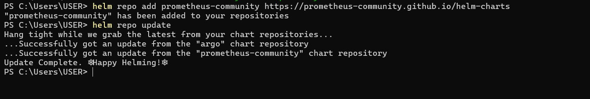


### Step 8.4: Verify Installation

```bash
kubectl get pods -n monitoring
```
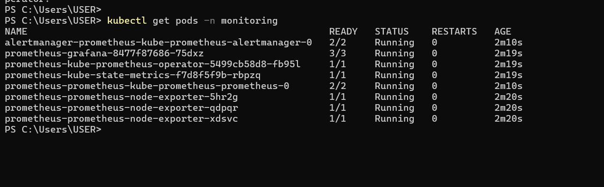

### Step 8.5: Access Grafana

```bash
# Get Grafana password
kubectl get secret --namespace monitoring prometheus-grafana -o jsonpath="{.data.admin-password}" | base64 -d

# Port forward
kubectl port-forward -n monitoring svc/prometheus-grafana 3000:80
```

Open browser: `http://localhost:3000`

- Username: `admin`
- Password: (from previous command)


---

## 9. Metrics & Analysis

#### Step 9.1: Create Application with Metrics

Create enhanced `app.py` with metrics endpoint (app-v3)

Build v3:

```bash
docker build -t yourusername/canary-demo-app:v3 .
docker push yourusername/canary-demo-app:v3
```

#### Step 9.2: Create ServiceMonitor

Create `app/servicemonitor.yaml`

#### Step 9.3: Create AnalysisTemplate

Create `app/analysistemplate.yaml`

#### Step 9.4: Update Rollout with Analysis

Create `app/rollout-with-analysis.yaml`

Push to GitHub


## 10. Automated Rollback Testing

### Step 10.1: Configure Argo CD Application

1. Open Argo CD UI (`https://localhost:8080`)
2. Click **"+ NEW APP"**
3. Fill in the form:

**GENERAL:**
- Application Name: `canary-demo`
- Project: `default`
- Sync Policy: **Automatic**
  - ✅ PRUNE RESOURCES
  - ✅ SELF HEAL

**SOURCE:**
- Repository URL: `https://github.com/yourusername/canary-demo-manifests`
- Revision: `HEAD`
- Path: `app`

**DESTINATION:**
- Cluster URL: `https://kubernetes.default.svc`
- Namespace: `default`

4. Click **"CREATE"**


### Step 10.2: Get Application URL

```bash
# Get LoadBalancer external IP
kubectl get service canary-demo -n default

# Wait for EXTERNAL-IP (2-3 minutes)
```
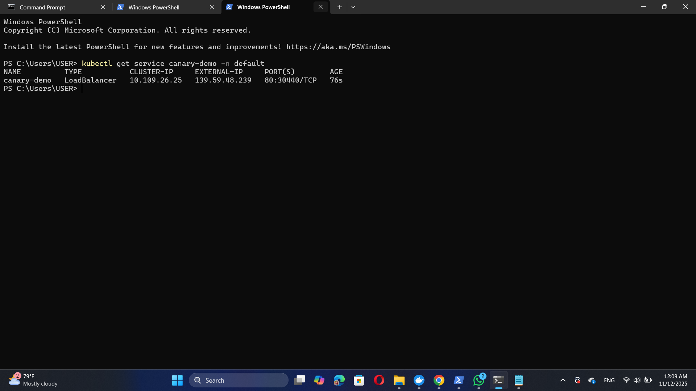

Once you have the IP, open in browser: `http://YOUR-EXTERNAL-IP`

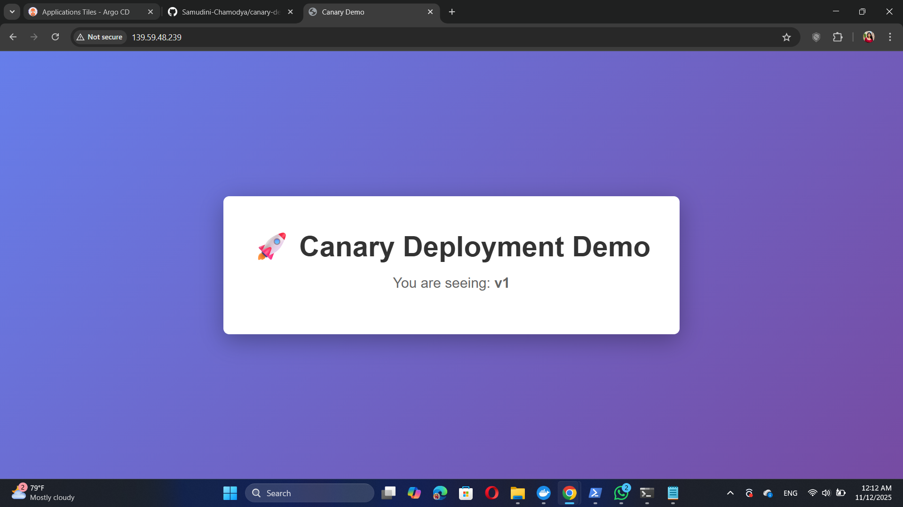


### Step 10.3: Start Rollout Dashboard

```bash
kubectl argo rollouts dashboard
```

Open browser: `http://localhost:3100`

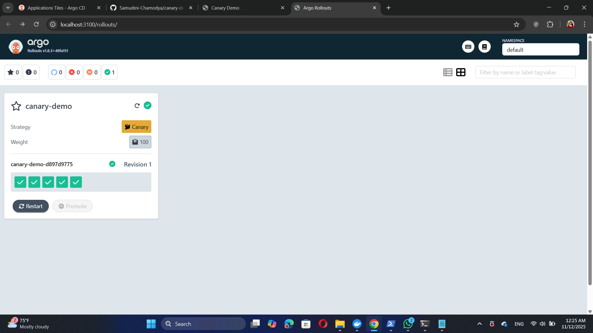

### Step 10.4: Deploy v2 (Successful Canary)

1. Edit `app/rollout-with-analysis.yaml` in GitHub
2. Change image: `yourusername/canary-demo-app:v1` → `yourusername/canary-demo-app:v2`
3. Commit changes

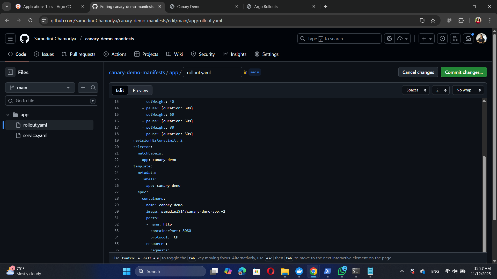

Watch the deployment:

```bash
# Terminal 1: Watch rollout status
kubectl argo rollouts get rollout canary-demo -n default --watch

# Terminal 2: Watch pods
kubectl get pods -n default -w
```

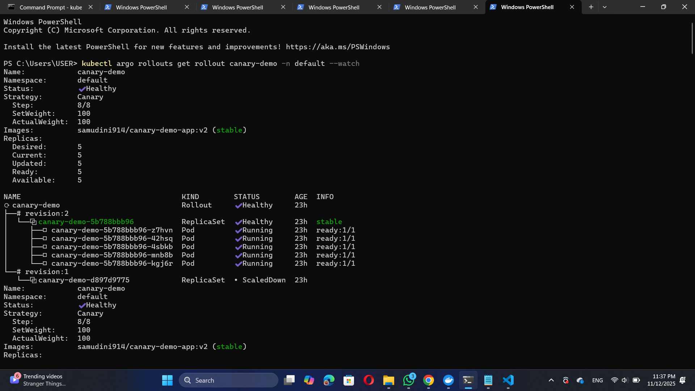

**What You'll See:**

1. **20% Traffic to v2** (30 seconds)
   - 1 pod running v2, 4 pods running v1

2. **Analysis Running**
   - Prometheus checks error rate
   - Success: Error rate < 5%

3. **40% Traffic to v2** (30 seconds)
   - 2 pods running v2, 3 pods running v1

4. **60% Traffic to v2** (30 seconds)
   - 3 pods running v2, 2 pods running v1

5. **80% Traffic to v2** (30 seconds)
   - 4 pods running v2, 1 pod running v1

6. **100% Traffic to v2** - Complete!
   - All 5 pods running v2
     
Refresh your browser to see the new version

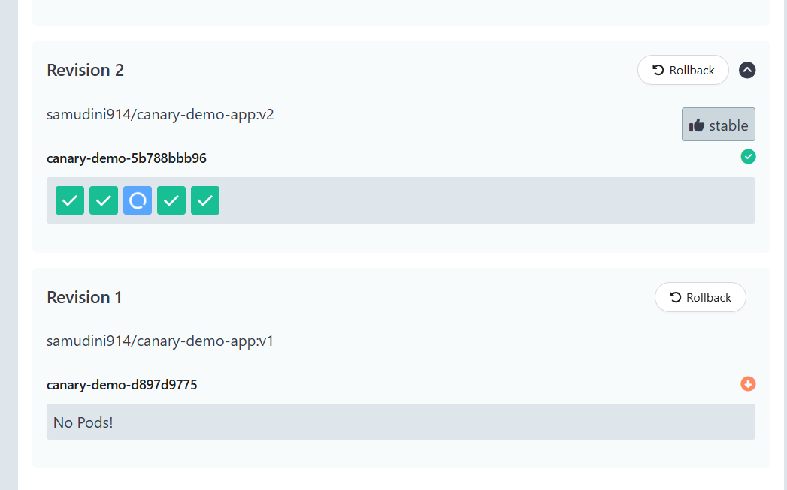


### Step 10.5: Deploy v3 (Failed Canary with Rollback)

Now let's test automatic rollback with a buggy version!

1. Edit `app/rollout-with-analysis.yaml` in GitHub
2. Change image: `yourusername/canary-demo-app:v2` → `yourusername/canary-demo-app:v3`
3. Commit changes


### Step 10.6: Generate Traffic

Open a new terminal and generate traffic to trigger errors:

```bash
# Get external IP
EXTERNAL_IP=$(kubectl get svc canary-demo -n default -o jsonpath='{.status.loadBalancer.ingress[0].ip}')

# Generate continuous traffic
while true; do
  curl -s http://$EXTERNAL_IP/ > /dev/null
  echo "Request sent at $(date)"
  sleep 1
done
```

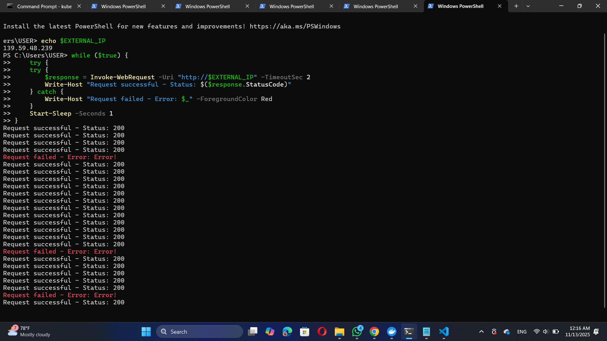

### Step 10.7: Watch the Automatic Rollback

Monitor the rollout:

```bash
kubectl argo rollouts get rollout canary-demo -n default --watch
```

**What Happens:**

1. **20% Traffic to v3** starts deploying
2. **Analysis begins** monitoring error rate
3. **Error rate exceeds 5%** threshold
4. **Analysis fails** after 3 consecutive failures
5. **Automatic rollback** to v2 initiated!

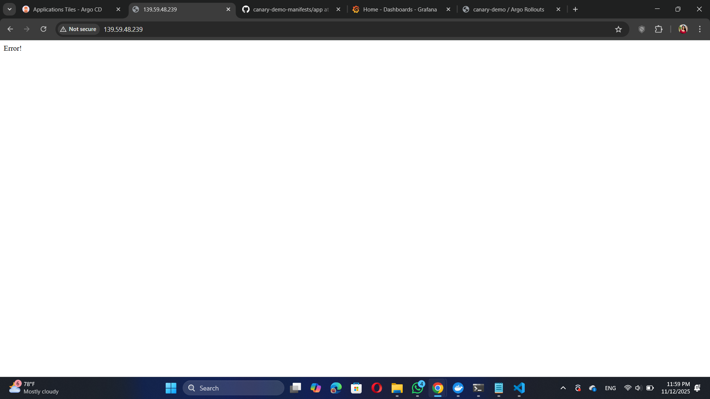


In Argo Rollouts Dashboard:

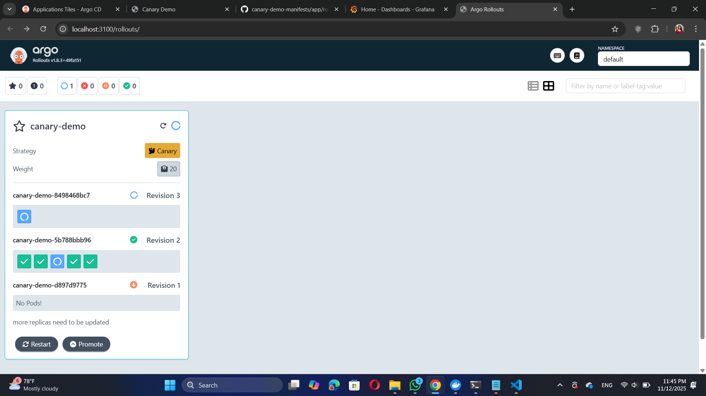

---

## 📊 Usage

### Monitoring Deployments

#### View Rollout Status
```bash
# Get current status
kubectl argo rollouts get rollout canary-demo -n default

# Watch real-time updates
kubectl argo rollouts get rollout canary-demo -n default --watch
```

#### Access Dashboards

**Argo Rollouts Dashboard:**
```bash
kubectl argo rollouts dashboard
# Open http://localhost:3100
```

**Argo CD UI:**
```bash
kubectl port-forward svc/argocd-server -n argocd 8080:443
# Open https://localhost:8080
```

**Grafana:**
```bash
kubectl port-forward -n monitoring svc/prometheus-grafana 3000:80
# Open http://localhost:3000
```

### Manual Rollout Control

#### Promote Canary
```bash
# Skip all pause steps and promote immediately
kubectl argo rollouts promote canary-demo -n default
```

#### Abort Rollout
```bash
# Abort and rollback to previous version
kubectl argo rollouts abort canary-demo -n default
```

#### Retry Failed Rollout
```bash
# Retry a failed rollout
kubectl argo rollouts retry rollout canary-demo -n default
```

### Viewing Metrics in Grafana

1. Log into Grafana (`http://localhost:3000`)
2. Click **"Dashboards"** → **"Browse"**
3. Navigate to **"Kubernetes / Compute Resources / Namespace (Pods)"**
4. Select namespace: `default`

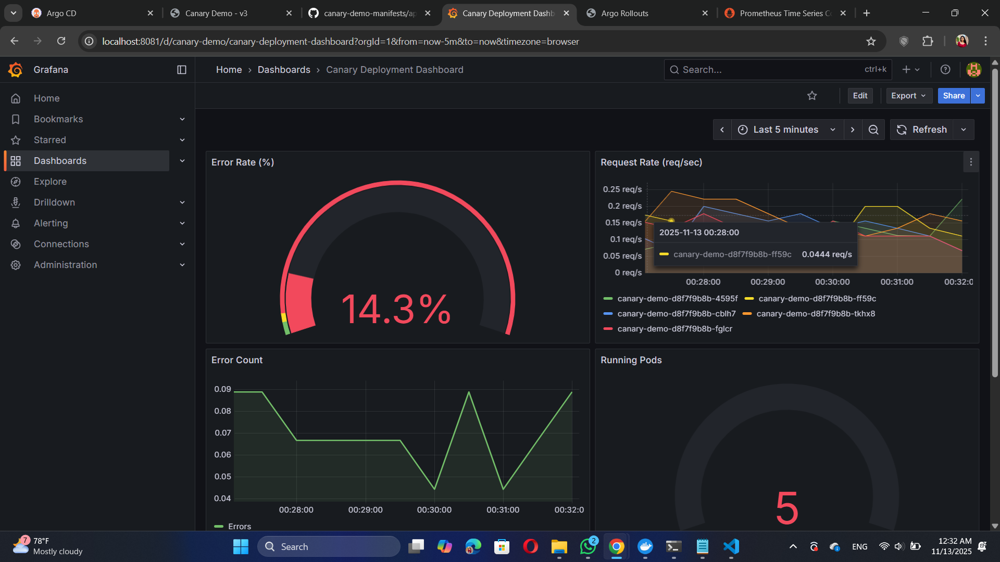

### Querying Prometheus

Access Prometheus UI:
```bash
kubectl port-forward -n monitoring svc/prometheus-kube-prometheus-prometheus 9090:9090
# Open http://localhost:9090
```
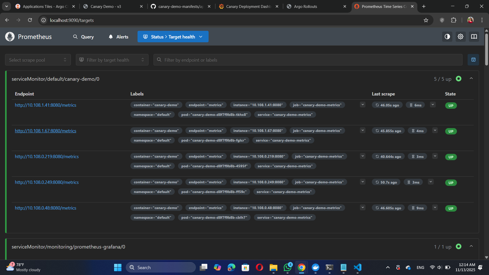

---

## Test Successful Canary Deployment (v3-fixed)

In this step, we’ll deploy a **stable v3-fixed** version of the `canary-demo` app to verify a **successful canary rollout** with no simulated errors.


###  Step 1: Update `app.py` (Remove Error Simulation) or create `app-v3.py`

Push it to github

```bash
docker build -t samudini914/canary-demo-app:v3-fixed --build-arg VERSION=v3 .
docker push samudini914/canary-demo-app:v3
```

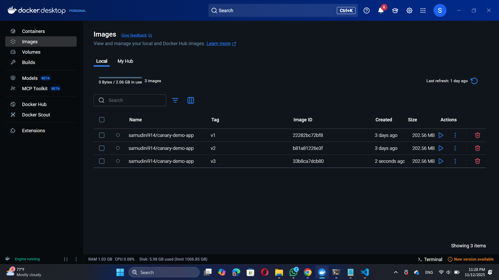

Edit your rollout file (app/rollout.yaml) and update the image and environment variable

```bash
image: samudini914/canary-demo-app:v3-fixed
env:
- name: VERSION
  value: "v3-fixed"
```

Apply the Changes

```bash
kubectl apply -f app/rollout.yaml
```
Monitor the rollout Process

```bash
kubectl argo rollouts get rollout canary-demo -n default --watch
```
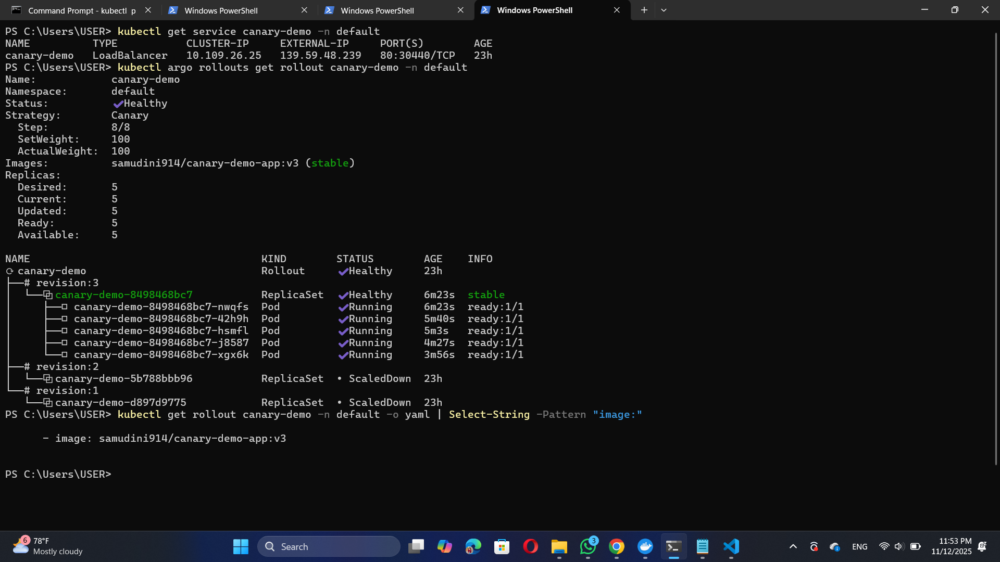

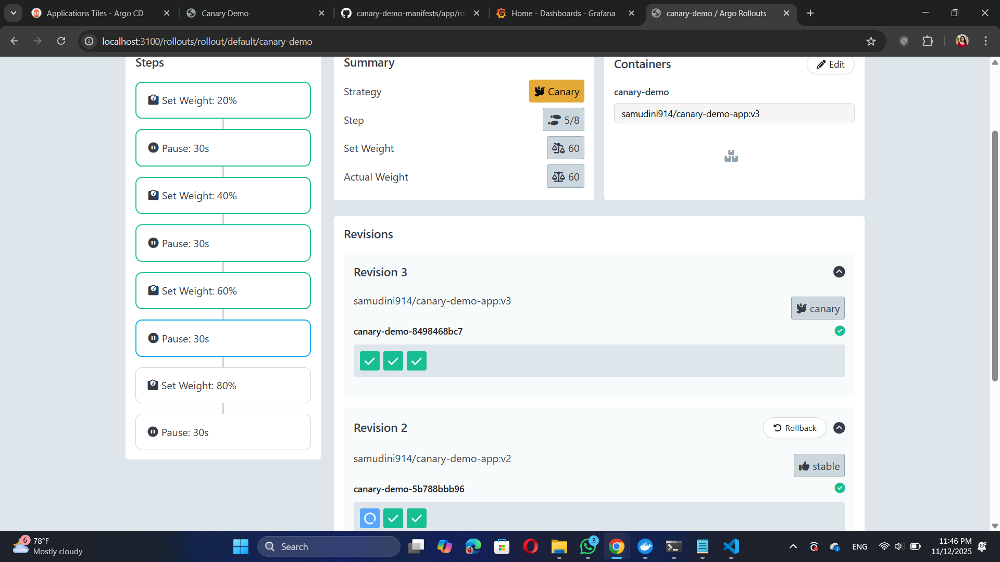

Refresh your browser

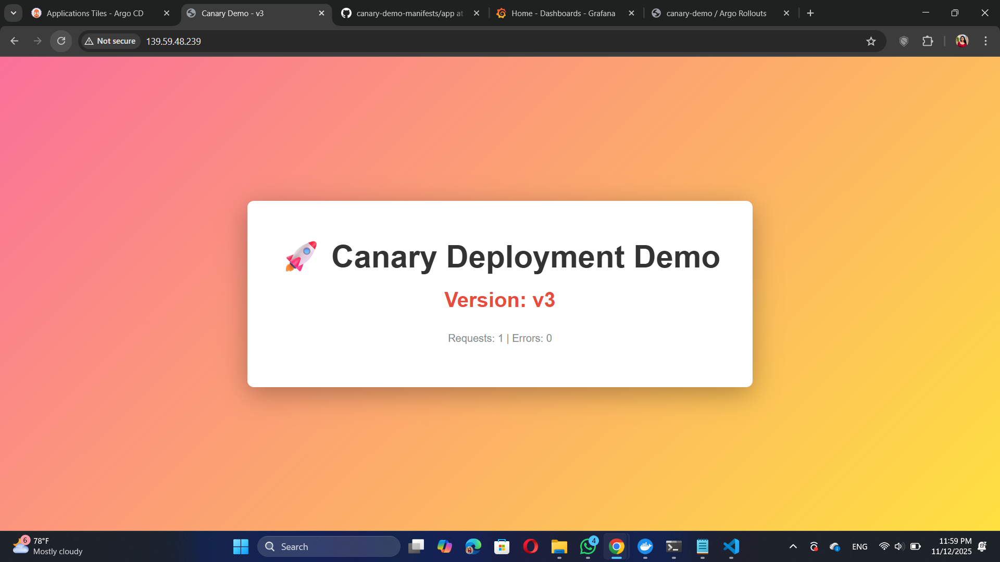

Grafana view of CPU, Memory, Network I/O, and Disk I/O 

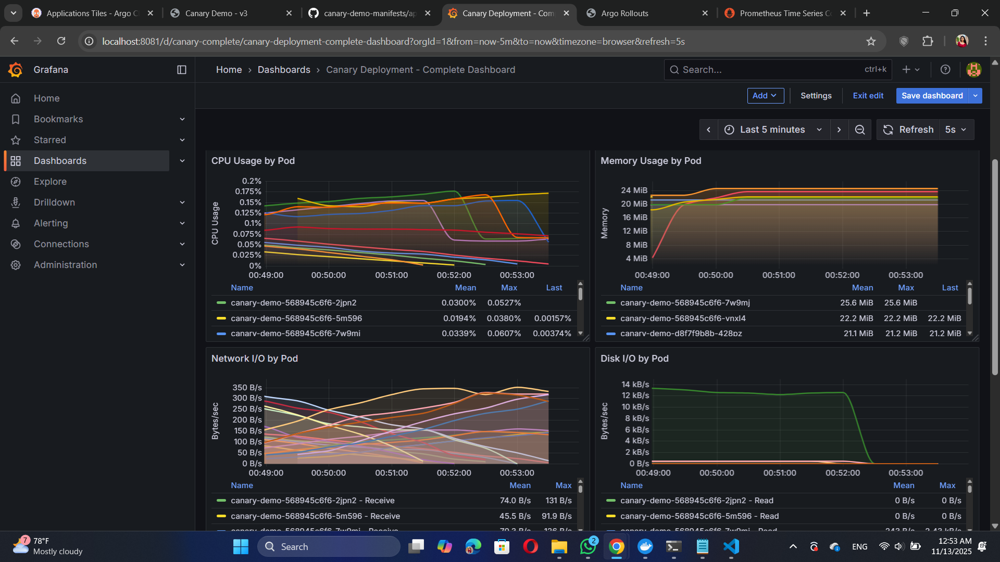

##### 🎉 Successfully completed a clean canary deployment!

Author- Samudini Roopasinha


